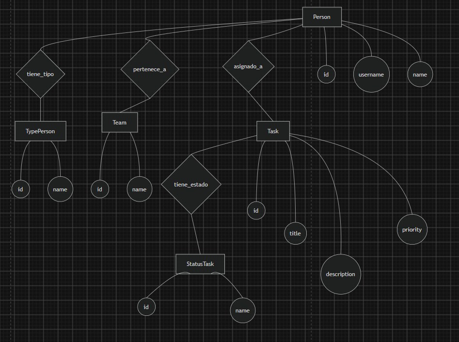
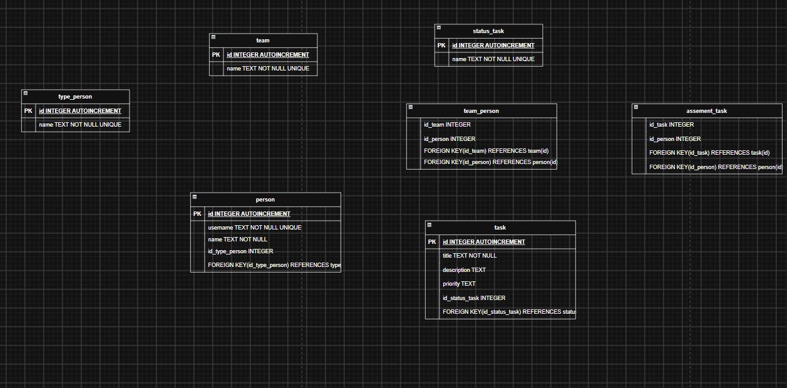
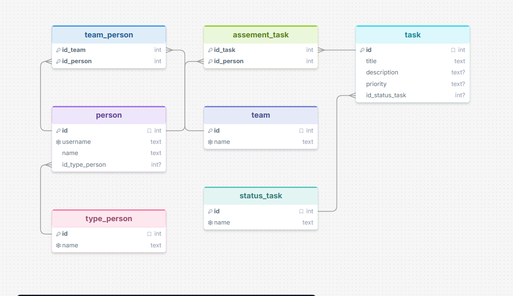

# TaskFlow - Sistema Profesional de Gestión de Tareas Scrum


## Descripción
TaskFlow es una solución de software orientada a la gestión eficiente de proyectos y tareas bajo la metodología **Scrum**. Diseñado para equipos que buscan un control de flujo de trabajo ágil, el sistema permite la creación, asignación y seguimiento de actividades mediante una base de datos robusta relacional (SQLite) y una moderna interfaz gráfica en Java Swing potenciada con **FlatLaf**.

## Objetivos
- Centralizar la información de las tareas para eliminar la ambigüedad en las responsabilidades del equipo.
- Integrar roles de Scrum (Product Owner, Scrum Master, Developer) a los usuarios del sistema.
- Proporcionar una herramienta visual, interactiva y fácil de usar mediante un Tablero Kanban (Por Realizar, En Proceso, Finalizado).
- Asegurar la **persistencia de los datos** utilizando una base de datos local SQLite.

## Modelado de Base de Datos y Diagramas

Para lograr una correcta persistencia y escalabilidad, el sistema ha sido diseñado bajo un modelo de Entidad-Relación estructurado en 7 tablas principales. A continuación se presentan los esquemas gráficos del modelo relacional generados con diferentes herramientas:

### 1. Modelo Entidad-Relación Tradicional (Notación de Chen)
En este diagrama visualizamos las entidades (cuadrados), sus relaciones (rombos) y sus atributos (círculos).

*Explica cómo los usuarios (`person`) tienen un rol (`type_person`), pertenecen a un equipo (`team`) y se les asignan tareas (`task`) que a su vez tienen un estado (`status_task`).*

### 2. Esquema Relacional en Draw.io

*Este diagrama muestra la estructura de las tablas generadas al importar nuestro script SQL directamente en Draw.io, definiendo las llaves primarias e identificadores básicos.*

### 3. Modelo Estructural en DrawSQL

*Una vista mucho más técnica que resalta explícitamente las Llaves Foráneas (Foreign Keys) y cómo interactúan las tablas puente (`team_person` y `assement_task`) para resolver las relaciones de muchos a muchos.*

## Arquitectura del Sistema
El sistema divide claramente la vista, los modelos y la capa de acceso a base de datos:

```text
proyecto_java/
├── bin/                 # Archivos compilados (.class)
├── img/                 # Capturas y diagramas de arquitectura
├── lib/                 # Librerías externas (.jar)
│   ├── flatlaf.jar      # Tema moderno de UI
│   └── sqlite-jdbc.jar  # Driver de base de datos
├── src/                 # Código fuente
│   ├── model/           # Entidades (Person, Task, Team...)
│   ├── service/         # Lógica de negocio y conexión (TaskManager, DatabaseConnection)
│   └── App.java         # Controlador Principal (GUI)
├── schema.sql           # Script de creación de base de datos
└── README.md
```

## Instrucciones de Instalación y Uso

### Prerrequisitos
- Tener instalado el JDK de Java (Versión 8 o superior).
- Las librerías de `sqlite-jdbc` y `flatlaf` ya están incluidas en la carpeta `lib/`.

### Pasos para ejecución local

1. Clonar el repositorio
   ```bash
   git clone https://github.com/santiagoosorio0708e-wq/gestion-tareas-base-datos-Scrum.git
   cd "proyecto java"
   ```

2. Compilar el código fuente
   Posicionado en la raíz del proyecto, ejecuta el siguiente comando para compilar las clases incluyendo las librerías:
   ```bash
   javac -cp "lib/sqlite-jdbc.jar;lib/flatlaf.jar" -d bin src/*.java src/model/*.java src/service/*.java
   ```

3. Iniciar la aplicación
   ```bash
   java -cp "bin;lib/sqlite-jdbc.jar;lib/flatlaf.jar" App
   ```
*(Nota: En sistemas Linux/Mac, reemplaza el punto y coma `;` por dos puntos `:` en el comando del classpath).*

## Contribuciones
Proyecto colaborativo desarrollado con enfoque en buenas prácticas de versionado y código limpio.

- Santiago Osorio
- Daniel Jaimes Gamboa

## Licencia
Proyecto de carácter académico.